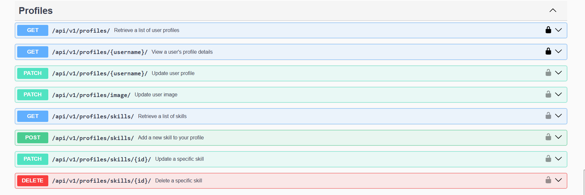
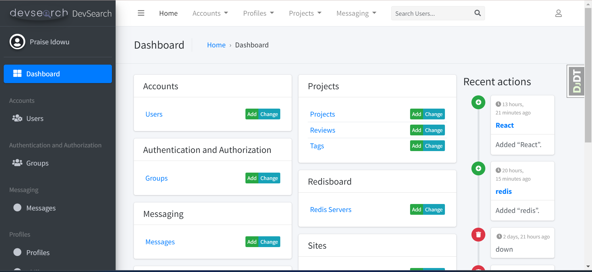

# DevSearch API


<br/>
[Live URL](https://infinite-beach-61393-2eb111cc1308.herokuapp.com/)

A Django REST API for a developer community platform where developers can showcase their projects, connect with other developers, and collaborate on exciting projects.

## 🚀 Features

- **Project Showcase**: Share and discover amazing developer projects
- **Developer Messaging**: Connect and communicate with other developers
- **Project Rating**: Rate and review other developers' work
- **Developer Search**: Find developers based on skills and location
- **User Authentication**: Secure JWT-based authentication
- **Admin Dashboard**: Comprehensive admin interface for platform management

## 🛠️ Tech Stack

- **Backend**: Django Rest Framework
- **Database**: PostgreSQL
- **Authentication**: JWT (Simple JWT)
- **Media Storage**: Cloudinary
- **Containerization**: Docker 
- **API Documentation**: DRF Spectacular (OpenAPI/Swagger)
- **Admin Interface**: Django Jazzmin
- **Testing:** APITestCase from DRF
- **Deployment**: Heroku
  
## 📋 Prerequisites

- Python 3.8+
- PostgreSQL
- Docker & Docker Compose 

## 🚀 Quick Start

### Option 1: Local Development

1. **Clone the repository**
   ```bash
   git clone <repository-url>
   cd devsearch-api
   ```

2. **Create and activate virtual environment**
   ```bash
   # Windows
   python -m venv env
   env\Scripts\activate
   
   # macOS/Linux
   python3 -m venv env
   source env/bin/activate
   ```

3. **Install dependencies**
   ```bash
   pip install -r requirements.txt
   ```
    Or using make:
   ```bash
   make reqn
   ```

4. **Environment Setup**
   - Copy `.env.example` to `.env`
   ```bash
   cp .env.example .env
   ```
   - Update the environment variables in `.env`:
    
5. **Database Setup**
   - Create PostgreSQL database
   - Run migrations:
   ```bash
   python manage.py migrate
   ```
   Or using make:
   ```bash
   make mig
   ```

6. **Create Superuser**
   ```bash
   python manage.py createsuperuser
   ```

7. **Run the development server**
   ```bash
   python manage.py runserver
   ```
   Or using make:
   ```bash
   make serv
   ```

### Option 2: Docker Development

1. **Clone the repository**
   ```bash
   git clone <repository-url>
   cd devsearch-api
   ```

2. **Environment Setup**
   - Copy `.env.example` to `.env` and update values

3. **Build and run with Docker**
   ```bash
   docker compose -f docker-compose.dev.yml up --watch
   ```
   From staticfiles, to migrations, to auperuser, to sample data, everything will be created as specified in the entrypoint.dev file.

### CI/CD Pipeline

This project uses GitHub Actions for continuous integration and deployment.

#### Setting up Environment Variables for GitHub Actions

1. **Convert your .env file to base64**
   ```bash
   # Run on Git Bash
   base64 .env > .env.base64
   ```

2. **Add the base64 string as a GitHub secret**
   - Go to your repository on GitHub
   - Navigate to Settings → Secrets and variables → Actions
   - Click "New repository secret"
   - Name: `ENV_FILE_CONTENTS`
   - Value: Paste the base64 encoded string from step 1
   - Name: `POSTGRES_PASSWORD`
   - Value: Any raw random password

3. **The GitHub Actions workflow will automatically:**
   - Decode the base64 string back to `.env`
   - Set up PostgreSQL test database
   - Install dependencies
   - Run migrations
   - Execute all tests
   - Report test results

## Windows Makefile Usage
To use the makefile on Windows:
1. Run PowerShell as administrator
2. Visit the [Chocolatey website](https://chocolatey.org/)
3. Install make: `choco install make`
4. You can now use make commands in your Django app

## 📁 Project Structure

```
devsearch-api/
├── .github/
│   └── workflows/        # GitHub Actions CI/CD workflows
├── apps/
│   ├── accounts/         # User authentication and management
│   ├── profiles/         # Developer profiles and skills
│   ├── projects/         # Project showcase and ratings
│   ├── messaging/        # Direct messaging system
│   └── common/          # Shared utilities and components
├── devsearch/
│   ├── settings/        # Environment-specific settings
│   ├── urls.py         # URL configuration
│   ├── wsgi.py         # WSGI configuration
│   └── asgi.py         # ASGI configuration for async support
├── deployment/         # Deployment scripts and configurations
├── env/            # Virtual environment (ignored in git)
├── fixtures/          # Initial data fixtures
├── logs/              # Application logs
├── static/            # Static files (CSS, JS, images)
├── templates/         # Email templates
├── docker-compose.dev.yml  # Development Docker configuration
├── Dockerfile         # Production Docker image definition
├── Dockerfile.dev     # Development Docker image definition
├── entrypoint.dev     # Development container entrypoint script
├── heroku.yml         # Heroku deployment configuration
├── Makefile          # Build automation scripts
├── requirements.txt   # Python dependencies
├── wait-for-it.sh    # Script to wait for services
└── manage.py         # Django management script
```

## 📚 API Documentation

The API is fully documented using OpenAPI/Swagger. Once the server is running, you can access the interactive API documentation.

### API Documentation Screenshots

  
  
  
  
  

### API Endpoints Overview

- **Authentication**: `/api/v1/accounts/` - User registration, login, password reset
- **Profiles**: `/api/v1/profiles/` - Developer profiles and skills
- **Projects**: `/api/v1/projects/` - Project CRUD operations and ratings
- **Messaging**: `/api/v1/messages/` - Direct messaging between developers

## 🔐 Admin Panel

Access the admin interface at `http://localhost:8000/admin/` using your superuser credentials.

The admin panel provides:
- User management
- Project moderation
- Message monitoring
- System analytics

### Admin Panel Screenshots

**Admin Login**
  

**Admin Dashboard**
  


## 🧪 Testing

Run the test suite:

```bash
python manage.py test
```

## 🤝 Contributing

1. Fork the repository
2. Create your feature branch (`git checkout -b feature/AmazingFeature`)
3. Commit your changes (`git commit -m 'Add some AmazingFeature'`)
4. Push to the branch (`git push origin feature/AmazingFeature`)
5. Open a Pull Request

## 📄 License

This project is licensed under the MIT License - see the LICENSE file for details.

## 📞 Support

If you have any questions or need help, please open an issue on GitHub.

---

**Built with ❤️ by Praise**

